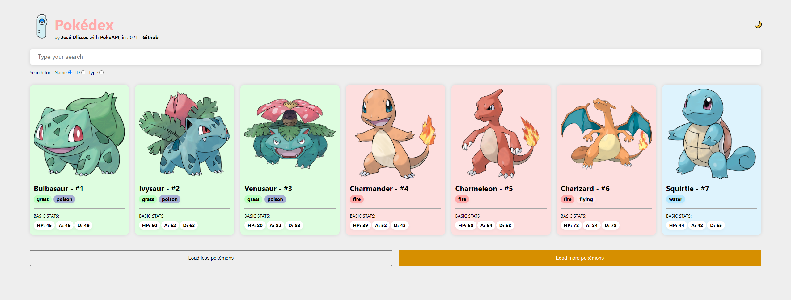

  
  <h1>Pokedex</h1>

   

<a
    href="https://jos3spokedex.netlify.app"
    title="Pokédex"
  >
    Visite a Pokédex aqui
</a> 

Esse projeto foi criado usando o ReactJS pelo [Create React App](https://github.com/facebook/create-react-app).

## Melhorias a serem feitas

- [x] Adicionar as estatísticas básicas dos pokémons
- [x] Permitir buscar por tipo e id, alem do nome
- [x] Adicionar um switch para o modo escuro

## Executar localmente

No diretório do projeto, você pode rodar:

### `yarn start`

Para rodar o app em modo de desenvolvimento localmente.\
Abra [http://localhost:3000](http://localhost:3000) para visualizar no navegador.
